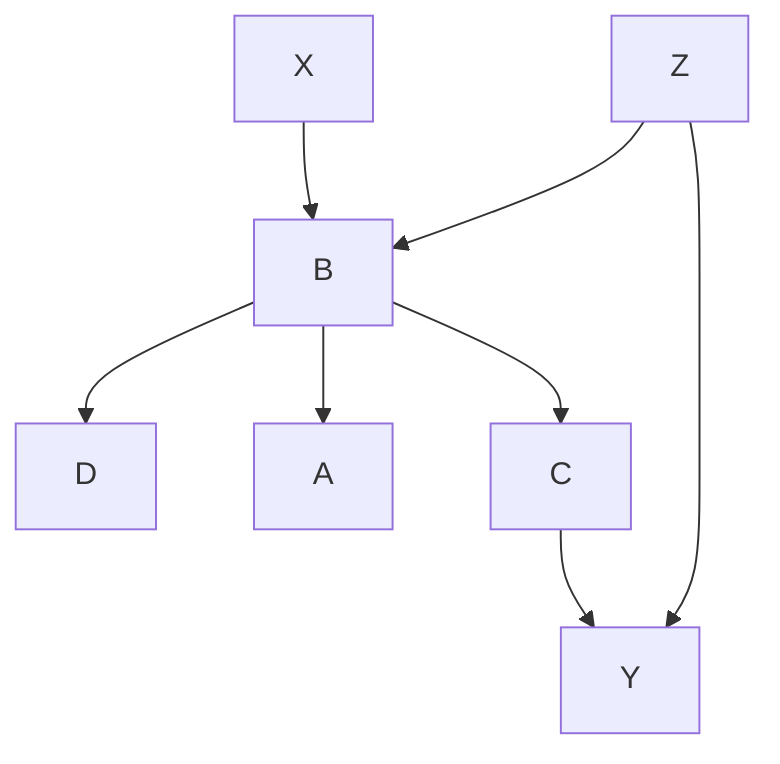

# Ghidra Script Shed (GSS)

- [Ghidra Script Shed (GSS)](#ghidra-script-shed-gss)
  - [SourceSinkSleuth.py](#sourcesinksleuthpy)
    - [Alternatives](#alternatives)
  - [RenameFuncsByLogs.py](#renamefuncsbylogspy)
    - [Changes](#changes)
  - [PreviewFunctionCapabilities.py](#previewfunctioncapabilitiespy)
    - [Changes](#changes-1)
  - [`0xdea` Scripts](#0xdea-scripts)
    - [Rhabdomancer.py](#rhabdomancerpy)
      - [Changes](#changes-2)
    - [Haruspex.py](#haruspexpy)
  - [Install](#install)

[](https://www.youtube.com/watch?v=TvamswF3lb0)

Ghidra Script Shed (GSS) is a small collection of scripts I created while working on some RE for fun. Most are slight improvements on other people's work, which I have cited heartily. Every single one of these tools has proven useful to me so I decided to make them more user-friendly and share them.

These were created for fun after I discovered Ghidra Scripting and wanted to try it out. They have been tested a decent amount but its hard to test some of these code paths since you would have to find a binary that fits.

> Extra user info is given in `NOTE`s throughout the code.

## [SourceSinkSleuth.py](./SourceSinkSleuth.py)

`SourceSinkSleuth` looks for paths where potentially attacker-controlled data is eventually input into a dangerous sink... at least that was the original intent. Turns out, taint-tracing is pretty tough to do so I ended up creating this instead.

`SourceSinkSleuth` *actually* takes a **source** function name, and looks for a code path from there to a **sink** function of your choice out of the `*_FOI` dictionary (also allows for custom functions of interest (FOIs)). There are two ways it does the searching: "forwards" or "backwards". 

Take for example a control flow scenario depicted below where the *Target Function* is **B**, and a *Function of Interest* is **Y**:

If *Search Forward* is chosen, the script would look in order at `D, A, C-->Y`. Otherwise, it would look at `X, Z-->Y`.

The order of the calls within the function isn't taken into consideration. This isn't a problem when searching forward because the flow logic takes care of it. However, for 'searching backwards', it has an effect. Take for example the *searching backwards* scenario above. 

If Z calls both B (tgt func) and Y (FoI), the script doesn't care about the order in which they are called. This is *by design* because you might want to know both if the FoI was called *before* our tgt func (e.g. Y==`recv`, B==`system`), or *after*  (e.g. B==`recv`, Y=`system`).

### Alternatives

If you're interested in more advanced, but more complicated, Control-flow analysis try [angr](https://github.com/angr/angr). Their [pypcode](https://github.com/angr/pypcode) library provides *Python bindings to Ghidra's SLEIGH library for disassembly and lifting to P-Code IR*.

There are also some cool Ghidra plugins out there already:
- [GhiHorn](https://insights.sei.cmu.edu/blog/ghihorn-path-analysis-in-ghidra-using-smt-solvers/)
  - Big brain 🧠 SMT-based (Z3 backend) path analysis tool by Jeff Gennari at CMU
  - [GitHub repo](https://github.com/CERTCC/kaiju/tree/main) (its a part of the CERT Kaiju project
- [AngryGhidra](https://github.com/Nalen98/AngryGhidra)
  - Allows you to use angr for binary analysis and symbolic execution in Ghidra interface.
  - *Not really taint analysis but could be modified/used rudimentarily*

## [RenameFuncsByLogs.py](./RenameFuncsByLogs.py)

There are many such scripts/blog posts out there but I would like to think this ones better. Based on the **Conviso Labs** blogpost https://blog.convisoappsec.com/en/automatically-renaming-functions-with-ghidra/ and the accompanying [script on GitHub](https://github.com/convisolabs/reversing_scripts/blob/main/ghidra/rename_functions.py).

This script allows the user to rename functions based on their calls to a logging function that includes their names. I've come accross this scenario quite often, especially in embedded devices. In once instance it helped me rename over 5,000 functions in one binary, which saved me tons of time and really helped me understand the binary more.

> *This is only helpful if your target binary has a logging function*.

**First** identify the logging function. **Next** determine what argument the calling function's name is given. This can be done by analyzing several calls of the logging function from different ambigous functions and getting the vibe. **Finally**, you can use this script! *Keep in mind the argument option is 0-indexed.*

Here's an example of identifying a logging function and the script arguments one would use:
```c
if (tVar2 < iVar1) {
    log_log(7,"deny_blockdevice_access",0x460,"deny count %d [%s] [%s]",
            (&DAT_00058268)[iVar4 * 0x12],puVar3,&DAT_0005829e + iVar4 * 0x48,param_4);
    return 1;
}
// log_log, index 1 would be the script arguments
```

### Changes

- Functional Enhancements:
    - UI Integration:
        - Allows the user to specify the logging function name and the argument index using text fields and dropdowns.
        - Provides checkboxes for enabling verbose output and aggressive mode.
    - Expanded Error Handling:
        - Includes robust error handling for retrieving functions, resolving references, and processing decompiled data.
    - Advanced Reference Handling:
        - Eliminates the 4,096-reference limit for analyzing function references, ensuring no potential calls are missed.
    - Candidate Resolution:
        - Implements logic to resolve argument values from decompiled code (resolve_varnode) and select the most popular function name based on usage.
        - *Necessary because sometimes calls within a function use different names to identify the caller*
    - Duplicate Prevention:
        - Appends function entry-point addresses to avoid name conflicts during renaming.
- General Improvements:
    - Script Feedback:
        - Outputs detailed console logs about skipped functions, errors, and renaming progress.

## [PreviewFunctionCapabilities.py](./PreviewFunctionCapabilities.py)

A modified version of the script created by **AGDC Services** at [AGDCservices/Ghidra-Scripts](https://github.com/AGDCservices/Ghidra-Scripts/blob/master/Preview_Function_Capabilities.py). More details and a video about the original at that GitHub repo.

This script analyzes undefined functions in a binary to generate meaningful names based on their capabilities, such as network, file, or thread operations, using P-code analysis for cross-architecture support. It propagates functionality from child to parent functions, ensures thread start detection, and adapts to Windows or Linux binaries for comprehensive capability previewing.

> Haven't tested the `get_thread_roots` much. Also could make the windows api search more robust 

### Changes

- Functional Enhancements:
    - Cross-Platform Support: Added *Linux-specific API mappings and categories* for enhanced functionality beyond Windows binaries.
    - Thread Root Detection: Introduced detection and naming for thread start functions using *architecture-independent P-code analysis*.
    - Dynamic API Purpose Mapping: Integrated mappings for API calls to capability categories for *more precise function previews*.
    - Enhanced OS Detection: *Automatically determines the target OS* (Windows/Linux) and adjusts analysis behavior accordingly.
- General Improvements:
    - Error Handling: Added robust *exception handling* to ensure stable execution during analysis.
    - Verbose Option: Configurable verbosity for *filtering out common functions* like `strlen` to *reduce noise*.

## `0xdea` Scripts

These are two scripts created by Marco Ivaldi at [0xdea/ghidra-scripts](https://github.com/0xdea/ghidra-scripts/tree/main). They are ported from Java to Python because ~~I hate Java~~ Python is simpler for most to understand and modify for their own needs.

### [Rhabdomancer.py](./Rhabdomancer.py)

Rhabdomancer locates all calls to potentially insecure functions (the candidate points), which have been classified in 3 different tiers of decreasing potential for exploitation, from 0 to 2.

#### Changes

- Functional Enhancements:
    - UI Overhaul:
        - Introduced a user-friendly UI using Java Swing components for:
            - Configurable global options (comments, bookmarks, verbosity). *Because you don't always want to bookmark and comment everything*.
            - OS-specific selection of potentially insecure functions based on tiers.
        - Enabled bulk selection (tier or category level) via hierarchical checkboxes.
    - Function Tier Categorization:
        - *Expanded the list of potentially insecure functions* with detailed categories (e.g., memory, string, environment, etc.) tailored *for each platform*.
    - Verbose Output:
        - Included *detailed console logging* to track which functions are being analyzed and the resulting actions.
- General Improvements:
    - Exception Handling:
        - Added safeguards to ensure robust behavior during the retrieval and processing of function references.

### [Haruspex.py](./Haruspex.py)

Ghidra script to extract pseudo-code from decompiler in a format suitable for IDE import or static analysis tools. 

There aren't much changes on this one, only the python rewrite and the output directory selection UI. I just wanted to include it because I think its pretty useful. The original author has [a blogpost](https://security.humanativaspa.it/automating-binary-vulnerability-discovery-with-ghidra-and-semgrep/) in which he explains both scripts. He also talks about *using his Semgrep rules with the output from this script*, which I found pretty useful!

## Install

Just copy these python scripts into your `ghidra_script` directory. You can get the available directories by going to `Windows -> Script Manager -> Manage Script Directories (Top Right)` in the Code Browser.

**Disclaimer**

As mentioned before these haven't been through crazy testing. In particular, Windows API stuff hasn't been tested at all. My focus while writing these was VR on Unix and Linux-like embedded IoT binaries. What I ~~believe~~ know will cause errors is the annoying Windows-ism of the Win32 API that differentiates (at least on the surface) between APIs that take Ascii Characters, and those that take Unicode Characters. Another similar issue is the functions that have an original method, and then an *Extended* method that adds more functionality.


The Extended methods are arguably usually different enough to warrant including a search for them separate from the original version, but the `A` vs `W` methods aren't. `PreviewFunctionCapabilities.py`, `Rhabdomancer.py`, and `SourceSinkSleuth.py` currently mostly have methods without the `EX`/`W`/`A` appended and likely won't match any of them if there is a variation of the original function used. I had a simple solution in mind where you just treat the function name match differently if a PE binary is being analyzed but never implemented it. Now that I've written this disclaimer I realize it might've been easier to just fix it... but I'll leave that up to you so you can practice your ghidra scripting prowess!!

